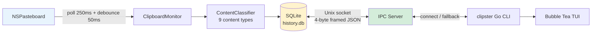

# Clipster

A macOS clipboard manager for terminal-native workflows.

```
clipster              # open TUI history browser
clipster last         # print most recent entry
clipster pins         # list pinned entries
clipster daemon status
```

Free and open source. No GUI app, no menu bar, no cloud sync.

---

## Architecture



| Component | Language | Role |
|-----------|----------|------|
| `clipsterd` | Swift | Headless daemon — clipboard monitoring, SQLite storage, IPC server |
| `clipster` | Go | CLI/TUI client — reads history, transforms, daemon management |

**Write ownership invariant:** `clipsterd` is the sole writer to `history.db`. `clipster` reads via IPC (daemon running) or directly from SQLite read-only (fallback).

### Data paths

| Path | Purpose |
|------|---------|
| `~/Library/Application Support/Clipster/history.db` | SQLite history database |
| `~/Library/Application Support/Clipster/clipster.sock` | IPC Unix socket |
| `~/.config/clipster/config.toml` | User configuration |
| `/tmp/clipsterd.log` | Daemon stdout/stderr |

---

## Install

```sh
# From source (requires Swift + Go)
git clone https://github.com/romeo-folie/clipster
cd clipster
make install
make install-launchagent

# Or with the install script
bash scripts/install.sh --build-from-source
```

The install script also handles binary downloads from GitHub Releases (once releases are published).

---

## Quick Start

```sh
# Open TUI (default when no args given)
clipster

# Last clipboard entry
clipster last

# Pinned entries
clipster pins

# Daemon management
clipster daemon status
clipster daemon start
clipster daemon stop
clipster daemon restart

# Config
clipster config          # print config
clipster config --edit   # open in $EDITOR
clipster config --reset  # restore defaults

# Clear history (prompts for confirmation)
clipster clear
clipster clear --force   # no prompt
```

---

## TUI Keybindings

| Key | Action |
|-----|--------|
| `j` / `↓` | Move down |
| `k` / `↑` | Move up |
| `/` | Inline filter |
| `Enter` | Paste selected entry |
| `p` | Pin / unpin |
| `d` | Delete (double-confirm) |
| `t` | Open transform panel |
| `q` / `Esc` | Quit |

---

## Configuration

`~/.config/clipster/config.toml` is created with defaults on first run.

```toml
[history]
entry_limit = 500          # 100 | 500 | 1000 | 0 (no count limit)
db_size_cap_mb = 500       # 100 | 250 | 500 | 1000 MB

[privacy]
suppress_bundles = [
  "com.1password.1password",
  "com.bitwarden.desktop",
  "com.dashlane.dashlane",
  "com.lastpass.LastPass"
]

[daemon]
log_level = "info"         # debug | info | warn | error
```

Changes take effect after `clipster daemon restart`.

---

## Transforms

Applied at paste time — non-destructive. Available in the TUI transform panel (`t`).

| Transform | Description |
|-----------|-------------|
| `uppercase` | ALL CAPS |
| `lowercase` | all lowercase |
| `trim` | Strip leading/trailing whitespace |
| `snake_case` | convert to snake_case |
| `camel_case` | convertToCamelCase |
| `url_encode` | Percent-encode for URLs |
| `url_decode` | Decode percent-encoded URLs |
| `base64_encode` | Base64 encode |
| `base64_decode` | Base64 decode |
| `strip_html` | Remove HTML tags |
| `md_to_plain` | Strip Markdown formatting |

---

## Build

Requires: macOS 13+, Xcode 16+, Go 1.22+.

```sh
# Build both binaries
make build

# Run all tests (Swift + Go)
make test

# Build clipsterd only
cd clipsterd && swift build -c release

# Build clipster only
cd clipster-client && go build ./cmd/clipster
```

> **Note:** Swift tests require Xcode.app (not just Command Line Tools).
> The Makefile uses `XCODE_DEVELOPER_DIR=/Applications/Xcode.app/Contents/Developer` automatically.

---

## Uninstall

```sh
bash scripts/uninstall.sh             # remove binaries + LaunchAgent, keep data
bash scripts/uninstall.sh --purge-data  # also remove history DB
```

---

## Module Documentation

- [`clipsterd/README.md`](clipsterd/README.md) — Swift daemon architecture, ClipsterCore components, IPC protocol
- [`clipster-client/README.md`](clipster-client/README.md) — Go CLI architecture, IPC client, TUI, fallback mode

---

## License

MIT
