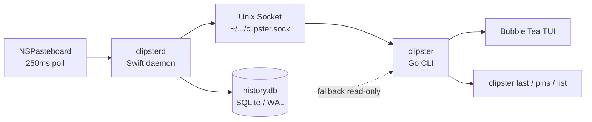

# Clipster

A terminal-native clipboard manager for macOS. Captures everything you copy, surfaces it instantly in an interactive TUI, and keeps your password manager entries private.

```
┌──────────────────────────────────────────────────────────────────────┐
│  Clipster — 42 entries                             [/] filter  [?]   │
├──────────────────────────────────────────────────────────────────────┤
│ ▶ ★ [text  ] Fix null pointer in auth middleware      Cursor · 2m    │
│   ★ [text  ] https://docs.example.com/api/v2          Chrome · 5m    │
│     [code  ] const fn = async (x) => x + 1            VS Code · 12m  │
│     [text  ] Meeting notes — product sync 2024-02...  Notes · 1h     │
│     [image ] <image 640×480>                          Screenshot · 2h │
├──────────────────────────────────────────────────────────────────────┤
│  Enter: copy  p: pin  d: delete  Tab: transform  /: filter  q: quit  │
└──────────────────────────────────────────────────────────────────────┘
```

---

## Install

```sh
curl -fsSL https://github.com/romeo-folie/clipster/releases/latest/download/install.sh | bash
```

**Requirements:** macOS 13 Ventura or later (arm64 or x86_64).

The installer:
1. Downloads the correct binaries for your architecture and verifies SHA-256 checksums
2. Installs `clipsterd` → `/usr/local/bin/clipsterd`
3. Installs `clipster` → `~/.local/bin/clipster` (or `/usr/local/bin/clipster` as fallback)
4. Registers and starts the daemon as a LaunchAgent
5. Verifies the daemon is running before declaring success

---

## Quick Start

```sh
clipster               # open interactive TUI
clipster last          # print the most recent clipboard entry
clipster pins          # list all pinned entries
clipster list          # plain-text list (non-TUI)
clipster clear         # clear clipboard history (with confirmation)
clipster config        # open config file in $EDITOR
clipster daemon status # show daemon status
```

---

## TUI Keybindings

| Key | Action |
|-----|--------|
| `↑` / `↓` or `k` / `j` | Navigate entries |
| `Enter` | Copy selected entry to clipboard |
| `/` | Open inline filter |
| `Esc` | Clear filter / close panel |
| `p` | Pin / unpin selected entry |
| `d` | Delete selected entry (with confirmation) |
| `Tab` | Open transform panel |
| `?` | Show help overlay |
| `q` / `Ctrl+C` | Quit |

---

## Transforms

Select an entry, press `Tab`, then choose a transform:

| Transform | Description |
|-----------|-------------|
| `uppercase` | UPPER CASE |
| `lowercase` | lower case |
| `trim` | Remove leading/trailing whitespace |
| `snake_case` | convert_to_snake_case |
| `camel_case` | convertToCamelCase |
| `encode_url` | URL percent-encode |
| `decode_url` | URL percent-decode |
| `encode_base64` | Base64 encode |
| `decode_base64` | Base64 decode |
| `strip_html` | Remove HTML tags |
| `count_words` | Count words in selection |

The result is copied to the system clipboard. The original entry is unchanged.

---

## Configuration

Config file: `~/.config/clipster/config.toml`

Created automatically on first daemon startup. Edit with `clipster config`, then `clipster daemon restart` to apply.

```toml
# Clipster configuration
# Changes take effect after: clipster daemon restart

[history]
entry_limit = 500          # Max clipboard entries to keep: 100 | 500 | 1000 | 0 (no count limit)
db_size_cap_mb = 500       # Max database size in MB: 100 | 250 | 500 | 1000

[privacy]
# App bundle IDs whose clipboard activity is silently suppressed.
suppress_bundles = [
  "com.1password.1password",
  "com.bitwarden.desktop",
  "com.dashlane.dashlane",
  "com.lastpass.LastPass"
]

[daemon]
log_level = "info"         # debug | info | warn | error
```

---

## Daemon

`clipsterd` runs as a macOS LaunchAgent — it starts automatically at login and restarts on crash.

```sh
clipster daemon status    # running / not running + PID
clipster daemon start     # load LaunchAgent + start
clipster daemon stop      # stop (launchd will not restart)
clipster daemon restart   # stop + start
```

Logs: `/tmp/clipsterd.log`

**Fallback mode:** If the daemon is not running, `clipster` enters read-only fallback mode — you can view history from the last known `history.db` but write operations are disabled.

---

## Privacy

Clipster suppresses clipboard events from password managers by default (1Password, Bitwarden, Dashlane, LastPass). Add any app's bundle ID to `suppress_bundles` in `config.toml` to extend suppression.

Find a bundle ID:
```sh
osascript -e 'id of app "AppName"'
```

---

## Uninstall

```sh
curl -fsSL https://github.com/romeo-folie/clipster/releases/latest/download/uninstall.sh | bash
```

Your clipboard history (`history.db`) and config (`config.toml`) are preserved. To remove everything:

```sh
curl -fsSL https://github.com/romeo-folie/clipster/releases/latest/download/uninstall.sh | bash -s -- --purge
```

---

## Architecture



- **`clipsterd`** — Swift daemon. Polls `NSPasteboard`, classifies content, writes to SQLite via GRDB. Exposes a Unix domain socket with a length-prefixed JSON protocol.
- **`clipster`** — Go CLI. Connects to the daemon socket for all reads/writes. Falls back to direct SQLite read-only access when the daemon is offline.

See [clipsterd/README.md](clipsterd/README.md) and [clipster-client/README.md](clipster-client/README.md) for detailed architecture docs.

---

## Performance

| Metric | Apple Silicon target | Intel target |
|--------|---------------------|--------------|
| `clipsterd` idle CPU | < 1% | < 2% |
| `clipsterd` memory (RSS) | < 50 MB | < 80 MB |
| `clipster` startup to interactive | < 300 ms | < 500 ms |

Measured on a clean system with history at default cap (500 entries).

```sh
make bench-startup   # measure CLI startup time
make bench-daemon    # show clipsterd CPU and memory
```

---

## Development

```sh
make build           # build clipsterd (release)
make test            # run Swift tests
make install         # install daemon binary
make install-launchagent  # write plist + start daemon
make help            # list all targets
```

See [PHASES.md](PHASES.md) for implementation history and architectural decisions.
