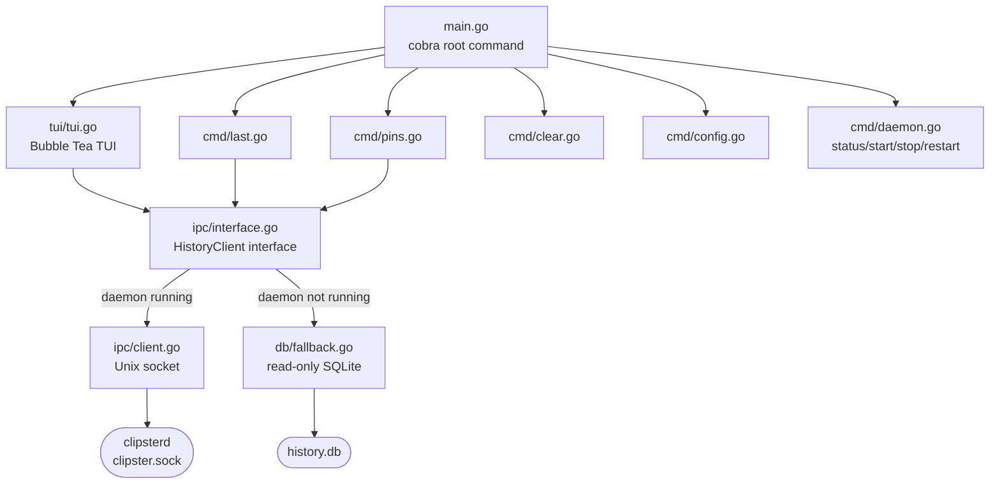

# clipster

Go CLI and TUI client for Clipster. Connects to `clipsterd` via Unix socket IPC. Falls back to read-only SQLite access when the daemon is not running.

---

## Architecture



---

## Components

### `internal/ipc`

**`HistoryClient` interface** (`interface.go`) — implemented by both `IPCClient` and `FallbackClient`. Commands that mutate state (`Pin`, `Unpin`, `Delete`, `Transform`, `Clear`) return `ErrDaemonRequired` from `FallbackClient`.

**`IPCClient`** (`client.go`) — connects to `~/Library/Application Support/Clipster/clipster.sock`. Uses 4-byte big-endian length-prefixed JSON framing (matching the Swift server). Connection timeout: 500ms. `IsDaemonRunning()` checks socket file existence.

### `internal/db`

**`FallbackClient`** (`fallback.go`) — read-only SQLite access via `modernc.org/sqlite` (pure Go, no CGO). Used when `clipsterd` is not running. Satisfies `HistoryClient` for read operations.

### `internal/tui`

**Bubble Tea TUI** (`tui.go`) — launched as the default command (no args). Features: scrollable list, inline filter (`/`), content type icons, source app display, `source_confidence` dimming, pin/unpin, delete (double-confirm), transform panel overlay. Falls back gracefully — shows read-only banner and disables write actions when daemon is offline.

### `internal/format`

**Output formatter** (`output.go`) — consistent formatting for entries in list and detail views. Type icons, source attribution, timestamp formatting.

### `cmd/clipster`

One file per command registered with [cobra](https://github.com/spf13/cobra):

| File | Command |
|------|---------|
| `main.go` | Root + default TUI |
| `last.go` | `clipster last` |
| `pins.go` | `clipster pins` |
| `clear.go` | `clipster clear [--force]` |
| `config.go` | `clipster config [--edit] [--reset]` |
| `daemon.go` | `clipster daemon status\|start\|stop\|restart` |

---

## Fallback Mode

When `clipsterd` is not running, `clipster` displays:

```
⚠  clipsterd not running — read-only mode. Run: clipster daemon start
```

Read operations (list, last, pins) continue against the SQLite database directly. Write operations (pin, unpin, delete, transform, clear) print an error and exit 1.

---

## IPC Protocol

Client side of the protocol defined in `clipsterd/Sources/ClipsterCore/IPCProtocol.swift`.

```go
// Send a command
type Request struct {
    Version int             `json:"version"`
    ID      string          `json:"id"`
    Command string          `json:"command"`
    Params  json.RawMessage `json:"params,omitempty"`
}

// Receive a response
type Response struct {
    ProtocolVersion int             `json:"protocol_version"`
    ID              string          `json:"id"`
    OK              bool            `json:"ok"`
    Data            json.RawMessage `json:"data"`
    Error           string          `json:"error"`
}
```

Framing: `[4-byte big-endian uint32 length][JSON body]`

---

## Build

```sh
cd clipster-client

# Build
go build -o clipster ./cmd/clipster

# Test
go test ./...

# Release build (stripped)
go build -ldflags="-s -w" -o clipster ./cmd/clipster
```

Requires Go 1.22+. No CGO (`modernc.org/sqlite` is pure Go).
