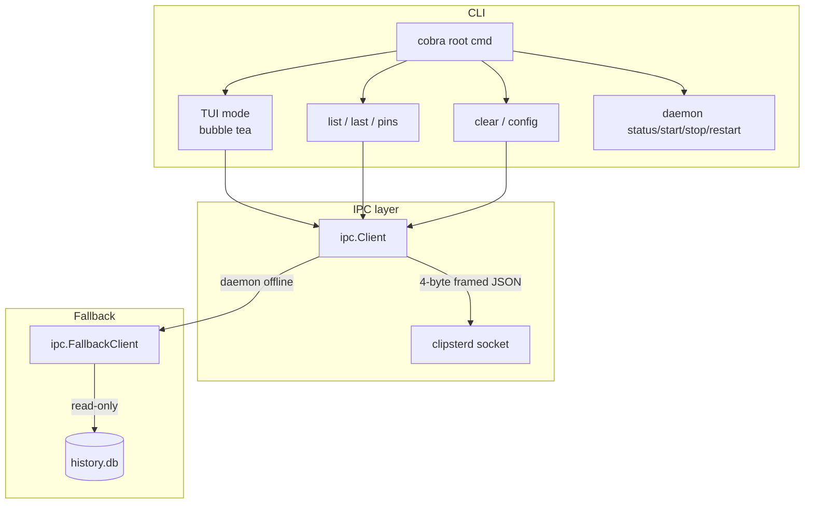
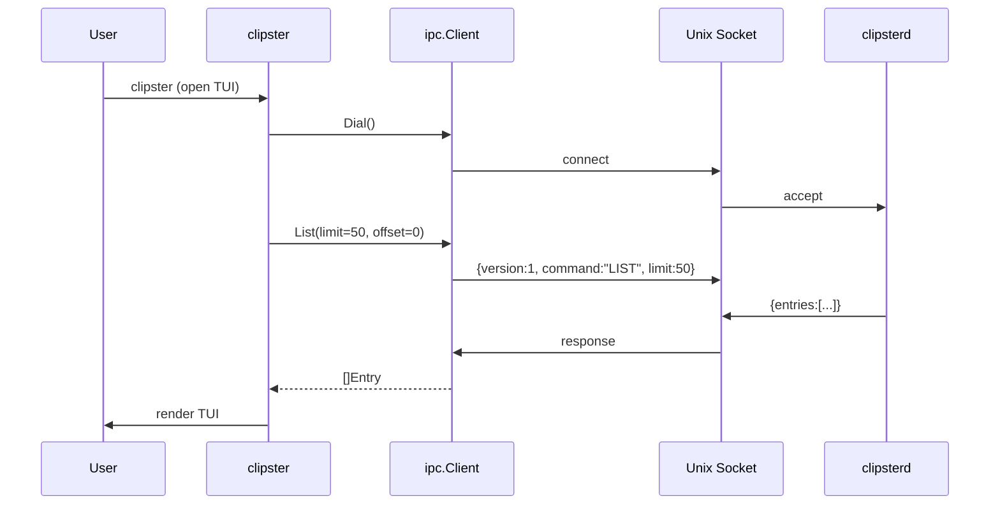
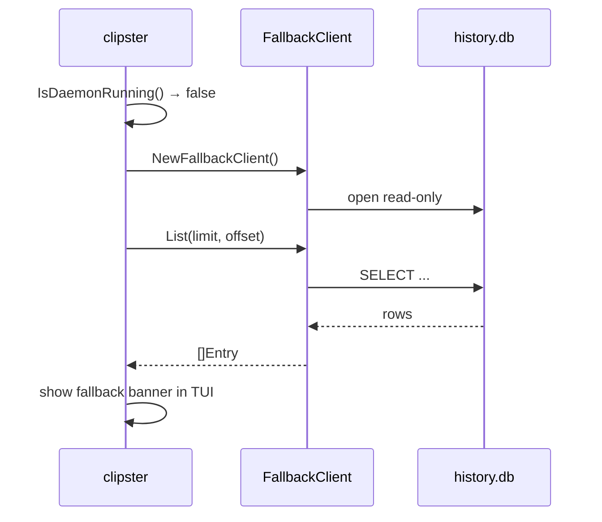
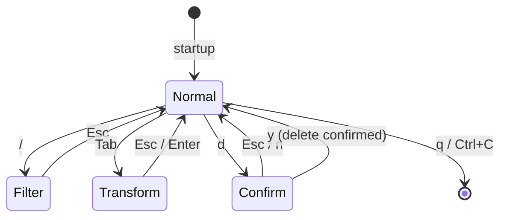

# clipster (CLI)

The Clipster command-line interface. A Go binary that connects to the `clipsterd` daemon via Unix socket and provides both an interactive Bubble Tea TUI and direct subcommands for scripting.

---

## Purpose

`clipster` is the user-facing half of Clipster. It does not own any data — all reads and writes go through the `clipsterd` IPC socket. When the daemon is offline, it falls back to a read-only direct SQLite connection so history is never inaccessible.

---

## Architecture



---

## Components

### `cmd/clipster/main.go`
Cobra root command. No subcommand → launches TUI. Connects to daemon socket if available; falls back to read-only `FallbackClient` if not. Registers all subcommands.

### `cmd/clipster/daemon.go`
`clipster daemon status|start|stop|restart`. Uses `launchctl` for start/stop; queries the IPC socket for status.

### `cmd/clipster/last.go`
`clipster last` — prints the most recent clipboard entry to stdout.

### `cmd/clipster/pins.go`
`clipster pins` — lists all pinned entries in plain text.

### `cmd/clipster/clear.go`
`clipster clear` — prompts for confirmation, then sends `CLEAR` command to daemon.

### `cmd/clipster/config.go`
`clipster config` — opens `~/.config/clipster/config.toml` in `$EDITOR` (falls back to `vi`).

### `internal/ipc/client.go`
Implements `HistoryClient` for IPC-connected mode. Dials the Unix socket, sends 4-byte length-prefixed JSON envelopes, reads responses. All commands include `"version": 1`.

### `internal/ipc/fallback_test.go` / `framing_test.go`
Tests for the fallback client and the wire framing (length prefix encode/decode).

### `internal/ipc/interface.go`
`HistoryClient` interface — implemented by both `ipc.Client` (daemon-connected) and `ipc.FallbackClient` (direct DB). Allows TUI and subcommands to be transport-agnostic.

### `internal/db/fallback.go`
Read-only SQLite client. Opens `history.db` directly without going through the daemon. Used when `IsDaemonRunning()` returns false. Never writes.

### `internal/tui/tui.go`
Full Bubble Tea TUI. Implements the PRD §7.5 spec: list view, inline filter, keybindings, type icons, source display, pin/unpin, delete with confirmation, transform panel with error display, fallback mode banner.

### `internal/format/output.go`
Entry formatting for plain-text (non-TUI) output: `clipster list`, `last`, `pins`. Shared between commands.

---

## Data Flow



**Fallback path:**



---

## TUI State Machine



---

## IPC Wire Format

All messages: 4-byte big-endian `uint32` length prefix, followed by UTF-8 JSON.

```
[0x00, 0x00, 0x00, 0x2F] <29 bytes of JSON>
{"version":1,"command":"LIST","limit":20,"offset":0}
```

Response:
```json
{
  "protocol_version": 1,
  "entries": [
    {
      "id": "...",
      "content_type": "text",
      "preview": "Fix null pointer in auth middleware",
      "source_name": "Cursor",
      "source_bundle": "com.cursor.app",
      "source_confidence": "high",
      "is_pinned": false,
      "created_at": "2024-02-24T14:32:10Z"
    }
  ]
}
```

---

## Build

```sh
cd clipster-client

# Current arch
go build -o clipster ./cmd/clipster/

# Cross-compile darwin/arm64
GOOS=darwin GOARCH=arm64 go build -o clipster-darwin-arm64 ./cmd/clipster/

# Cross-compile darwin/amd64 (Intel)
GOOS=darwin GOARCH=amd64 go build -o clipster-darwin-amd64 ./cmd/clipster/

# Tests
go test ./...
```

**Requirements:** Go 1.22+.

---

## Package Structure

```
clipster-client/
├── go.mod
├── go.sum
├── cmd/
│   └── clipster/
│       ├── main.go        # root cmd + TUI launcher
│       ├── daemon.go      # clipster daemon ...
│       ├── last.go        # clipster last
│       ├── pins.go        # clipster pins
│       ├── clear.go       # clipster clear
│       └── config.go      # clipster config
└── internal/
    ├── db/
    │   └── fallback.go    # read-only SQLite fallback
    ├── format/
    │   ├── output.go      # plain-text entry formatting
    │   └── output_test.go
    ├── ipc/
    │   ├── interface.go   # HistoryClient interface
    │   ├── client.go      # daemon-connected client
    │   ├── framing_test.go
    │   └── fallback_test.go
    └── tui/
        └── tui.go         # Bubble Tea TUI
```
