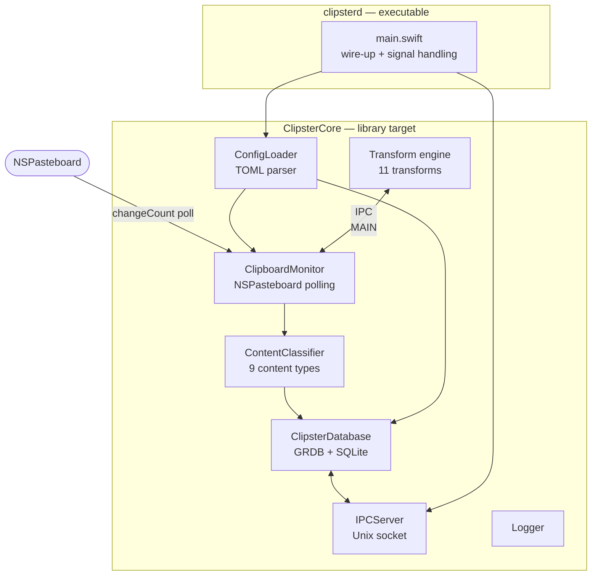
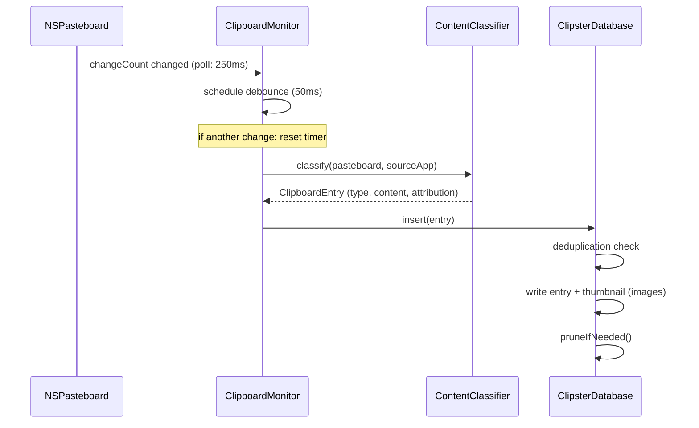

# clipsterd

Headless Swift daemon. Monitors the macOS clipboard, stores entries in SQLite, and serves them via a Unix socket IPC server.

---

## Architecture



---

## Components

### `ClipboardMonitor`
Polls `NSPasteboard.general.changeCount` every **250ms**. On change, waits **50ms** (debounce) before reading content — prevents capturing intermediate values during programmatic paste sequences. Captures frontmost app via `NSWorkspace` at detection time; compares at capture time to set `source_confidence`.

### `ContentClassifier`
Stateless. Called on each debounced pasteboard change. Detects content type in priority order: image → file URL → rich-text → plain-text sub-types (url, code, colour, email, phone). Code detection is heuristic (≥2 signals). Source attribution (bundle ID, app name) passed in from `ClipboardMonitor`.

### `ClipsterDatabase`
GRDB-backed SQLite wrapper. Single writer (`clipsterd`). WAL mode. Versioned migrations. Responsibilities:
- Insert entries with deduplication (same content hash as most recent = dropped)
- Generate JPEG thumbnails for image entries (≤ 400px wide, ≤ 2MB)
- Enforce `entry_limit` and `db_size_cap_mb` after each insert (pinned entries never pruned)
- VACUUM after bulk deletions (≥10 rows)
- All read operations (list, pins, find, thumbnail, count)
- Write operations (pin, unpin, delete, clear)

### `ConfigLoader`
Minimal TOML parser (no external dependency). Parses `~/.config/clipster/config.toml`. Creates file with defaults on first run. Invalid values log a warning and fall back to defaults — daemon never exits on bad config.

### `IPCServer`
Unix domain socket server at `~/Library/Application Support/Clipster/clipster.sock`. Protocol: 4-byte big-endian length prefix + UTF-8 JSON body. Handles 9 commands: `list`, `pins`, `pin`, `unpin`, `delete`, `last`, `transform`, `clear`, `daemon_status`. Rejects unsupported protocol versions.

### `Transform`
11 transforms applied at request time (non-destructive): uppercase, lowercase, trim, snake_case, camel_case, url_encode, url_decode, base64_encode, base64_decode, strip_html, md_to_plain.

---

## Data Flow



---

## IPC Protocol

```
Client → Server:
  [4-byte big-endian length][JSON body]

  {
    "version": 1,
    "id": "<uuid>",
    "command": "list",
    "params": { "limit": 50, "offset": 0 }
  }

Server → Client:
  [4-byte big-endian length][JSON body]

  {
    "protocol_version": 1,
    "id": "<uuid>",
    "ok": true,
    "data": { "entries": [...] },
    "error": null
  }
```

Commands: `list`, `pins`, `pin`, `unpin`, `delete`, `last`, `transform`, `clear`, `daemon_status`

---

## Configuration

`~/.config/clipster/config.toml` — created with defaults on first run.

| Key | Default | Valid values |
|-----|---------|-------------|
| `history.entry_limit` | 500 | 100, 500, 1000, 0 |
| `history.db_size_cap_mb` | 500 | 100, 250, 500, 1000 |
| `privacy.suppress_bundles` | [4 password managers] | array of bundle IDs |
| `daemon.log_level` | info | debug, info, warn, error |

---

## Build

```sh
cd clipsterd
swift build -c release
# Output: .build/release/clipsterd

# Tests (requires Xcode.app)
DEVELOPER_DIR=/Applications/Xcode.app/Contents/Developer swift test
```
