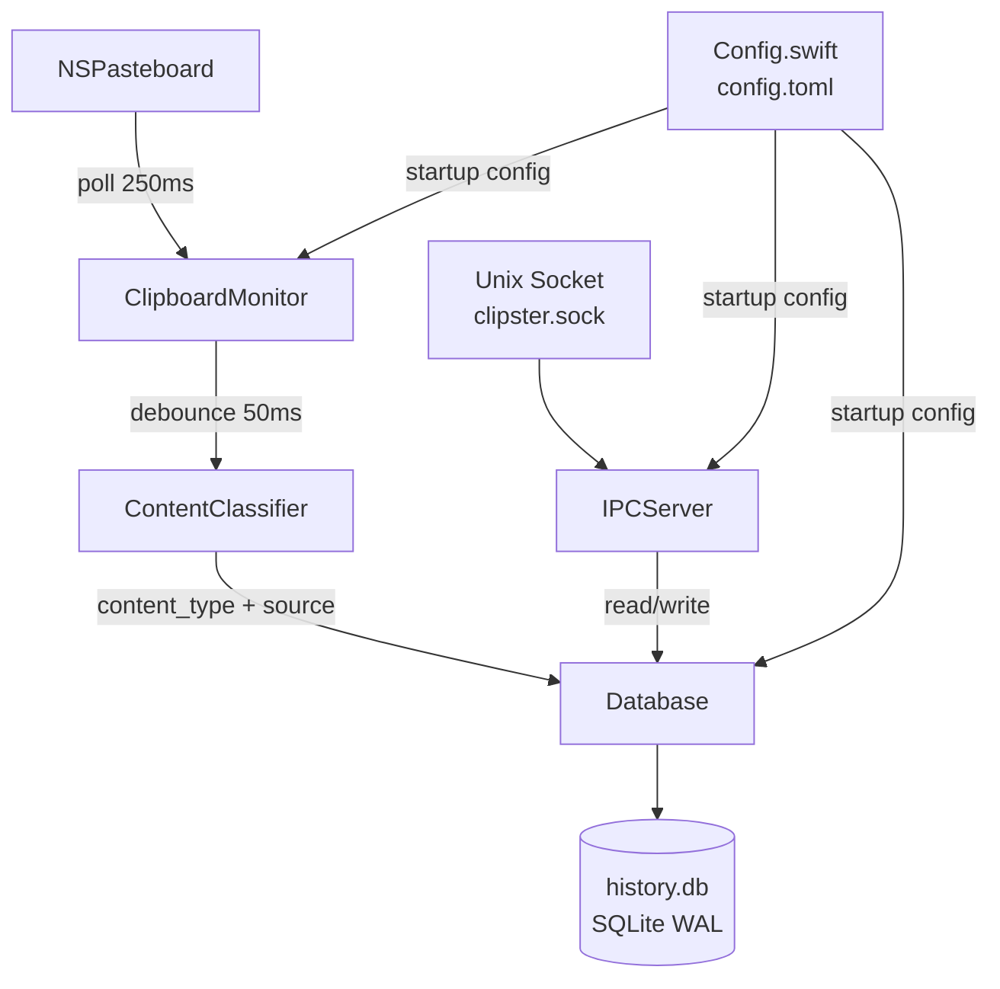
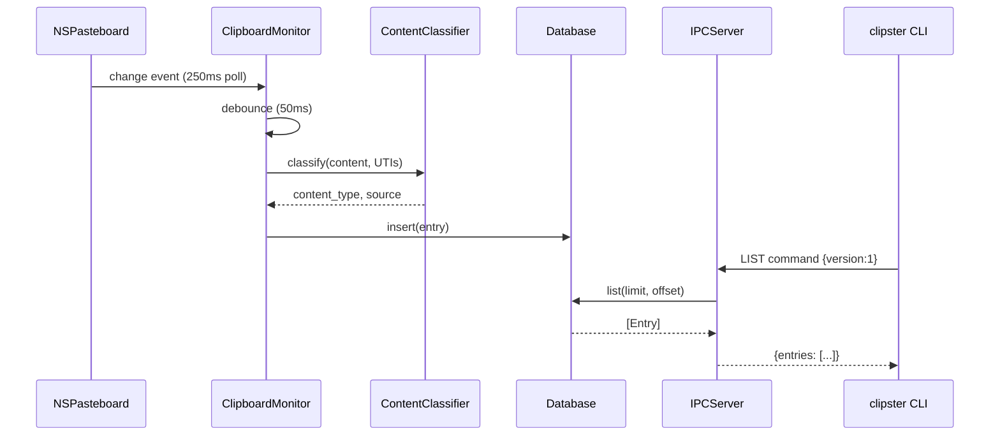

# clipsterd

The Clipster daemon. A Swift process that runs as a macOS LaunchAgent, monitors the system clipboard, and exposes clipboard history to the CLI via a Unix domain socket.

---

## Purpose

`clipsterd` owns two things: **capture** and **serving**.

- **Capture:** Polls `NSPasteboard` every 250ms, debounces events by 50ms, classifies content, suppresses password managers, and writes new entries to `history.db`.
- **Serving:** Listens on a Unix domain socket and handles JSON-framed commands from the `clipster` CLI — list, pin, delete, transform, and status.

The CLI has no direct knowledge of how or where data is stored. All data access goes through the socket protocol.

---

## Architecture



---

## Components

### `ClipboardMonitor`
Polls `NSPasteboard` using a `DispatchSourceTimer` at 250ms intervals. On change, waits 50ms (debounce), captures the frontmost application via `NSWorkspace`, and records `source_confidence` based on whether the active app changed during the debounce window. Passes content to `ContentClassifier`, then writes to `Database`.

Suppresses content from any app in `suppress_bundles` (config) — no entry is created, no placeholder stored.

### `ContentClassifier`
Determines the `content_type` of a new clipboard entry:

| Type | Detection |
|------|-----------|
| `text` | Default for plain text |
| `code` | Heuristic: language keywords, indent patterns, semicolons, brackets |
| `url` | Parses as URL; valid HTTP/HTTPS scheme |
| `rich-text` | `public.rtf` or `NSAttributedString` UTI present |
| `image` | `public.image` UTI present (stored as JPEG thumbnail ≤ 400px / 2MB) |
| `file-path` | `public.file-url` UTI present |

### `Database`
Wraps GRDB 6.x for all SQLite access. WAL mode. Handles schema migrations, entry writes, pin/unpin, delete, list with offset/limit, and database size reporting.

Enforces the **write ownership invariant**: only `clipsterd` writes to `history.db`. The CLI reads via IPC. The fallback client in the CLI opens the DB read-only when the daemon is offline.

### `IPCServer`
Listens on a Unix domain socket at `~/Library/Application Support/Clipster/clipster.sock`. Uses 4-byte big-endian length-prefixed JSON framing (matches the Go client framing in `clipster-client/internal/ipc`).

All messages carry `"version": 1`. Unsupported protocol versions are rejected with `"unsupported_protocol_version"`. Supports concurrent connections via a `DispatchQueue`.

### `IPCProtocol`
Defines the shared command/response envelope types used by both the server (Swift) and the CLI client (Go). Kept in sync manually — the source of truth is the IPC spec in `PRD §7.6`.

### `Config`
Loads `~/.config/clipster/config.toml` at daemon startup. Creates the file with commented defaults if absent (AC-CFG-01). Validates all fields; invalid values produce a log warning and fall back to defaults — the daemon never exits on a bad config.

### `Logging`
Thin wrapper around `os.Logger` (Unified Logging). Respects the `log_level` config field. All output also goes to `stdout` → `/tmp/clipsterd.log` via the LaunchAgent plist.

### `Transform`
Implements the 11 clipboard transforms (uppercase, lowercase, trim, snake_case, camel_case, encode_url, decode_url, encode_base64, decode_base64, strip_html, count_words). Called by `IPCServer` when the CLI sends a `TRANSFORM` command.

---

## Data Flow



---

## Configuration

Config file: `~/.config/clipster/config.toml`

Created with defaults on first startup if absent. Reload requires `clipster daemon restart`.

| Field | Section | Default | Valid values |
|-------|---------|---------|-------------|
| `entry_limit` | `[history]` | 500 | 0, 100, 500, 1000 |
| `db_size_cap_mb` | `[history]` | 500 | 100, 250, 500, 1000 |
| `suppress_bundles` | `[privacy]` | 4 password managers | Any bundle ID strings |
| `log_level` | `[daemon]` | `"info"` | `debug`, `info`, `warn`, `error` |

---

## Build

```sh
# From repo root
make build        # release binary → clipsterd/.build/release/clipsterd
make test         # run ClipsterCore tests
make build-universal  # arm64 + x86_64 universal binary → dist/
```

**Requirements:** Swift 5.9+, macOS 13 SDK.

---

## Database Schema

`~/Library/Application Support/Clipster/history.db`

```sql
CREATE TABLE history (
    id           TEXT PRIMARY KEY,
    content      BLOB    NOT NULL,
    content_type TEXT    NOT NULL,
    preview      TEXT    NOT NULL,
    source_name  TEXT,
    source_bundle TEXT,
    source_confidence TEXT NOT NULL DEFAULT 'high',
    is_pinned    INTEGER NOT NULL DEFAULT 0,
    created_at   TEXT    NOT NULL
);

CREATE TABLE thumbnails (
    id           TEXT PRIMARY KEY REFERENCES history(id) ON DELETE CASCADE,
    data         BLOB NOT NULL
);
```

WAL mode. Vacuum runs when DB exceeds `db_size_cap_mb`.

---

## Package Structure

```
clipsterd/
├── Package.swift
├── Sources/
│   ├── ClipsterCore/          # Library target — all reusable logic
│   │   ├── ClipboardMonitor.swift
│   │   ├── Config.swift
│   │   ├── ContentClassifier.swift
│   │   ├── Database.swift
│   │   ├── IPCProtocol.swift
│   │   ├── IPCServer.swift
│   │   ├── Logging.swift
│   │   └── Transform.swift
│   └── clipsterd/             # Executable target
│       └── main.swift         # Startup, signal handling, RunLoop
└── Tests/
    └── ClipsterCoreTests/
        ├── ClipboardMonitorTests.swift
        ├── ConfigTests.swift
        ├── ContentClassifierTests.swift
        └── DatabaseTests.swift
```
