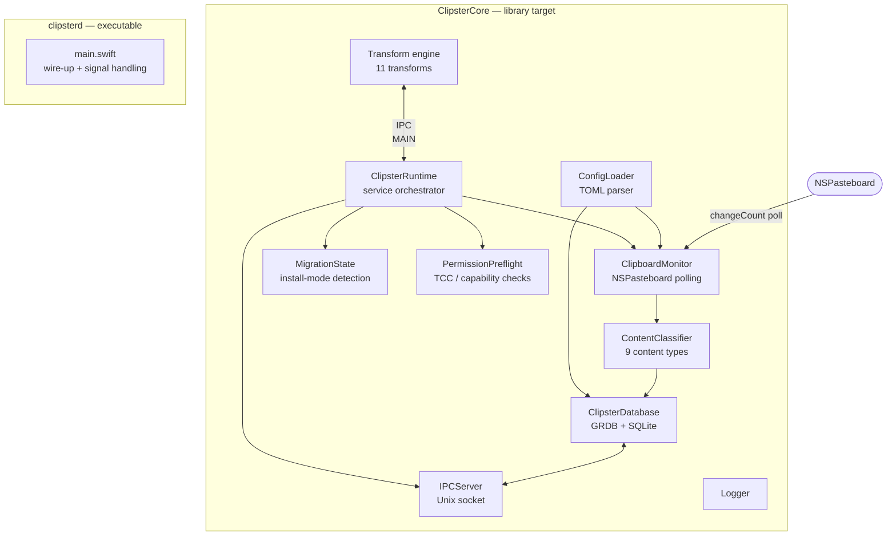
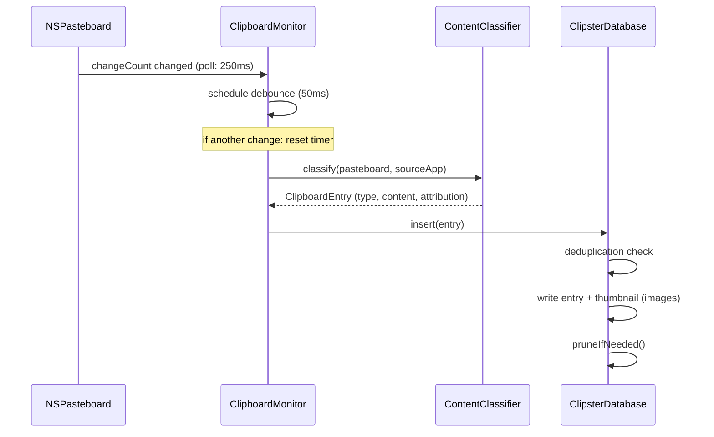
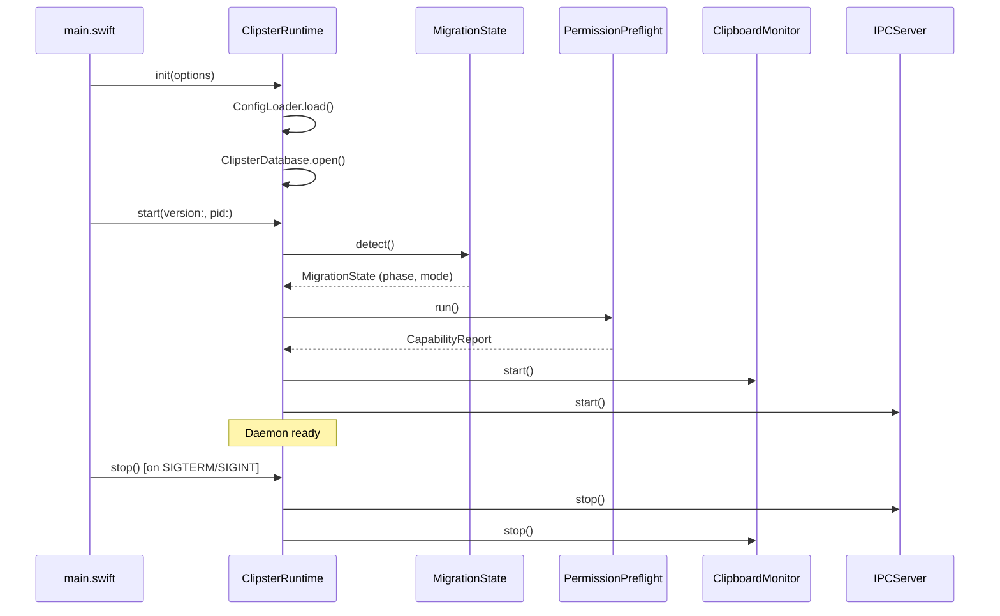

# clipsterd

Headless Swift daemon. Monitors the macOS clipboard, stores entries in SQLite, and serves them via a Unix socket IPC server. Designed for GUI evolution: the `ClipsterCore` library target is importable by a future AppKit layer without rewriting core services (PRD §14.1).

---

## Architecture



---

## Components

### `ClipsterRuntime`
Service orchestrator introduced in Phase 4 (PRD §14.1). Owns the full startup/shutdown lifecycle of all core services. Accepts a `RuntimeOptions` struct that controls the launch mode (`headless` | `app`). Runs identical core services in both modes; GUI/AppKit wiring is a Phase 5 concern.

Startup sequence:
1. Load config via `ConfigLoader`
2. Open SQLite database via `ClipsterDatabase`
3. Log migration state from `MigrationState.detect()`
4. Run permission preflight via `PermissionPreflight.run()`
5. Start `ClipboardMonitor`
6. Start `IPCServer`

### `MigrationState`
Detects the current install mode and migration phase by inspecting the filesystem and environment.

| Phase | Condition | Mode |
|-------|-----------|------|
| `legacyOnly` | LaunchAgent plist present, no app env | `launchAgent` |
| `appOnly` | No plist, `CLIPSTER_RUNTIME_MODE=app` | `appBundle` |
| `dual` | Both present (mid-migration) | `appBundle` |

Provides:
- `rollbackSteps: [String]` — per-phase recovery procedure
- `compatibilityWarning(for: String) -> String?` — advisory for `daemon start|stop|restart` in app mode

### `PermissionPreflight`
Runs at daemon startup to surface permission issues early (PRD §9). Informational only — a failed check logs a warning but does not abort startup.

| Capability | macOS 14+ behaviour | Phase 4 status |
|-----------|---------------------|---------------|
| Pasteboard (TCC) | `.notDetermined` until first use | Advisory warning |
| Accessibility (AX) | `.notDetermined` (AX wired in Phase 5) | Advisory only |

`CapabilityReport.isReady` returns `true` unless a capability is explicitly `.denied`.

`SecurityChecklist.items` is a static notarisation/signing checklist for the Phase 5 app-bundle transition.

### `ClipboardMonitor`
Polls `NSPasteboard.general.changeCount` every **250ms**. On change, waits **50ms** (debounce) before reading content — prevents capturing intermediate values during programmatic paste sequences. Captures frontmost app via `NSWorkspace` at detection time; compares at capture time to set `source_confidence`.

### `ContentClassifier`
Stateless. Called on each debounced pasteboard change. Detects content type in priority order: image → file URL → rich-text → plain-text sub-types (url, code, colour, email, phone). Code detection is heuristic (≥2 signals). Source attribution (bundle ID, app name) passed in from `ClipboardMonitor`.

### `ClipsterDatabase`
GRDB-backed SQLite wrapper. Single writer (`clipsterd`). WAL mode. Versioned migrations. Responsibilities:
- Insert entries with deduplication (same content hash as most recent = dropped)
- Generate JPEG thumbnails for image entries (≤ 400px wide, ≤ 2MB)
- Enforce `entry_limit` and `db_size_cap_mb` after each insert (pinned entries never pruned)
- VACUUM after bulk deletions (≥10 rows)
- All read operations (list, pins, find, thumbnail, count)
- Write operations (pin, unpin, delete, clear)

### `ConfigLoader`
Minimal TOML parser (no external dependency). Parses `~/.config/clipster/config.toml`. Creates file with defaults on first run (`load()` delegates to `load(at: URL)` — injectable for testing). Invalid values log a warning and fall back to defaults — daemon never exits on bad config.

### `IPCServer`
Unix domain socket server at `~/Library/Application Support/Clipster/clipster.sock`. Protocol: 4-byte big-endian length prefix + UTF-8 JSON body. Handles 9 commands: `list`, `pins`, `pin`, `unpin`, `delete`, `last`, `transform`, `clear`, `daemon_status`. Rejects unsupported protocol versions.

### `Transform`
11 transforms applied at request time (non-destructive): uppercase, lowercase, trim, snake_case, camel_case, url_encode, url_decode, base64_encode, base64_decode, strip_html, md_to_plain.

---

## Data Flow



---

## Startup Lifecycle



---

## IPC Protocol (v1)

```
Client → Server:
  [4-byte big-endian length][JSON body]

  {
    "version": 1,
    "id": "<uuid>",
    "command": "list",
    "params": { "limit": 50, "offset": 0 }
  }

Server → Client:
  [4-byte big-endian length][JSON body]

  {
    "protocol_version": 1,
    "id": "<uuid>",
    "ok": true,
    "data": { "entries": [...] },
    "error": null
  }
```

Commands: `list`, `pins`, `pin`, `unpin`, `delete`, `last`, `transform`, `clear`, `daemon_status`

Version mismatch error string: `"unsupported_protocol_version"` (contract-tested, must not change).

---

## Configuration

`~/.config/clipster/config.toml` — created with defaults on first run.

| Key | Default | Valid values |
|-----|---------|-------------|
| `history.entry_limit` | 500 | 100, 500, 1000, 0 |
| `history.db_size_cap_mb` | 500 | 100, 250, 500, 1000 |
| `privacy.suppress_bundles` | [4 password managers] | array of bundle IDs |
| `daemon.log_level` | info | debug, info, warn, error |

---

## Runtime Modes (Phase 4+)

| Mode | Trigger | Behaviour |
|------|---------|-----------|
| `headless` | Default / launchd | No AppKit; suitable for LaunchAgent |
| `app` | `--runtime-mode=app` or `CLIPSTER_RUNTIME_MODE=app` | Same core services; GUI wiring in Phase 5 |

Migration state is detected automatically and logged at startup. See `MigrationState` for rollback procedure.

---

## Build

```sh
cd clipsterd
swift build -c release
# Output: .build/release/clipsterd

# Tests (requires Xcode.app)
DEVELOPER_DIR=/Applications/Xcode.app/Contents/Developer swift test
```
