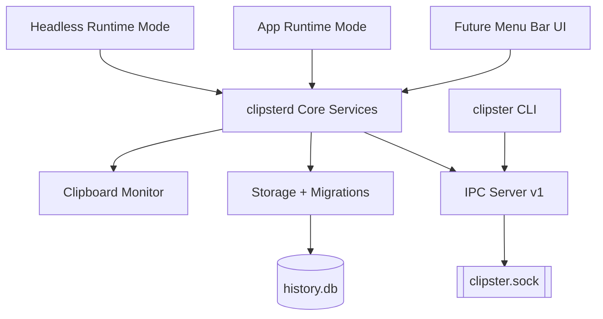
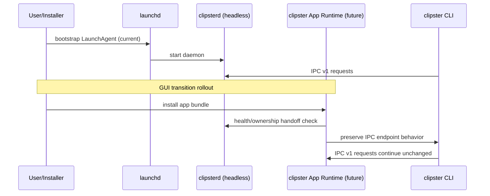

# Phase 4 — GUI Transition (Kickoff)

Status: In Progress  
Issue: https://github.com/romeo-folie/clipster/issues/19  
Source: PRD §14, §14.1

## Goal
Evolve `clipsterd` from headless LaunchAgent daemon into an app-bundle-capable runtime while preserving:

1. Existing IPC contract (`version:1`) for `clipster` CLI clients
2. Existing SQLite data compatibility
3. Backward-compatible config behavior

## Binding constraints (PRD §14.1)
- GUI phase builds on current daemon core; no greenfield replacement daemon.
- IPC protocol remains stable and versioned.
- Schema changes must be additive and migration-safe.
- Existing CLI clients must continue to function without protocol rewrites.

## Architecture model

### Runtime mode split
- **Headless mode**: current behavior; LaunchAgent-managed daemon process.
- **App mode**: future app-bundle runtime that embeds the same core service layer.

Both modes share the same core and persistence path to avoid data or protocol forks.

## Lifecycle transition sequence

## Risk register

| Risk | Impact | Mitigation |
|---|---|---|
| TCC/Accessibility permission mismatch between daemon/app modes | GUI features fail post-transition | Add preflight checks + capability flags (Issue #22) |
| Launch lifecycle confusion during migration | Users unable to start/stop reliably | Migration-compatible daemon command layer (Issue #21) |
| IPC behavior drift | Existing CLI breaks | IPC contract tests and version gates (Issue #23) |
| Schema incompatibility | Data corruption or startup failures | Additive-only migrations + regression suite (Issue #23) |
| Signing/notarisation differences for app bundles | Distribution blocked | Early signing matrix + CI checks (Issue #22) |

## Phase 4 issue breakdown

- **#19** Phase 4 kickoff/tracking
- **#20** App-capable runtime bootstrap (dual-mode `clipsterd`)
- **#21** Launch lifecycle migration plan (LaunchAgent → app lifecycle)
- **#22** Permissions and security preflight (TCC/Accessibility/CGEvent)
- **#23** IPC and schema compatibility contract tests

## Execution order
1. #20 Runtime bootstrap seams
2. #21 Lifecycle migration compatibility
3. #22 Permission/security preflight framework
4. #23 Contract/regression tests as a release gate

## Definition of done (Phase 4 foundation)
- Runtime mode architecture implemented without regressing headless mode
- Migration strategy documented and executable
- Permissions preflight framework in place
- IPC/schema compatibility tests green in CI
- Phase 5 GUI feature work can proceed without architectural rewrite
